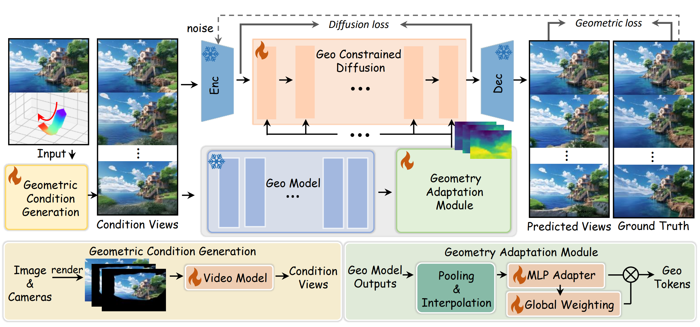

<p align="center">
  
</p>

<p align="center">
  <a href="https://peaes.github.io/GeoWorld/" target="_blank">
    
  </a>
  <a href="https://arxiv.org/abs/2511.23191" target="_blank">
    
  </a>
  <a href="https://arxiv.org/abs/2511.23191" target="_blank">
    
  </a>
</p>

<h4 align="center">GeoWorld: Unlocking the Potential of Geometry Models to Facilitate High-Fidelity 3D Scene Generation</h4>

<p align="center">
  <a href="https://scholar.google.com/citations?&user=kKyVqq0AAAAJ">Yuhao Wan</a><sup>1,2</sup>, <a href="https://scholar.google.com/citations?&user=nANxp5wAAAAJ">Lijuan Liu</a><sup>2</sup>, <a href="https://scholar.google.com/citations?&user=gHJrFr4AAAAJ">Jingzhi Zhou</a><sup>1</sup>, <a href="https://github.com/zhozhh">Zihan Zhou</a><sup>3</sup>, <a href="https://scholar.google.com/citations?&user=76_hOG0AAAAJ">Xuying Zhang</a><sup>1</sup>, <a href="https://scholar.google.com/citations?&user=rrJrH3oAAAAJ">Dongbo Zhang</a><sup>2</sup>, <a href="https://scholar.google.com/citations?&user=TiTxZloAAAAJ">Shaohui Jiao</a><sup>2</sup>, <a href="https://scholar.google.com/citations?user=fF8OFV8AAAAJ">Qibin Hou</a><sup>1,4</sup>, <a href="https://scholar.google.com/citations?user=huWpVyEAAAAJ">Ming-Ming Cheng</a><sup>4,1✉</sup>
</p>

<p align="center">
  <sup>1</sup>VCIP & AAIS, Nankai University &nbsp;&nbsp; <sup>2</sup>ByteDance Inc. &nbsp;&nbsp; <sup>3</sup>Renmin University of China &nbsp;&nbsp; <sup>4</sup>NKIARI, Shenzhen Futian
</p>

> GeoWorld uses a two-stage video-generation pipeline with full-frame geometry features to produce high-fidelity image-to-3D scenes faster than prior methods (7.5× faster than Hunyuan-Voyager). 

<p align="center">
  <video src="assets/concat.mp4" controls autoplay muted loop playsinline width="900" />
</p>

## 📬 News
- [2026.06] GeoWorld was accepted by ECCV 2026! The repository and project page are now available.


## 🔍 Overview



## 🔧 Installation

Python 3.11.2 and CUDA 12.4 are recommended.

```bash
git clone https://github.com/peaes/GeoWorld
cd GeoWorld

conda create -n GeoWorld python=3.11.2 -y
conda activate GeoWorld
```

```bash
pip install -r requirements_vggt.txt
pip install -r requirements.txt
```

## 🚀 Inference

1. Download the [VGGT weights](https://github.com/facebookresearch/vggt).
2. Download the [Wan2.1-Fun weights](https://huggingface.co/alibaba-pai/Wan2.1-Fun-1.3B-Control).
3. Download our [GeoWorld weights]() and place them under the `models/` directory.
4. Run the two inference scripts:

```bash
python examples/wan2.1_fun/batch_test_geoworld_stage1.py
python examples/wan2.1_fun/batch_test_geoworld_stage2.py
```

Before running, please fill in the VGGT weight path and the test directory path in both scripts.

### Inference dataset

The test directory should be a root folder containing several subfolders. Here is an example:

```text
test/
  case1/
    1.png
    1.mp4
  case2/
    1.png
    1.mp4
  case3/
    1.png
    1.mp4
```

Here, `1.png` is the input image and `1.mp4` is the projected partial-view video generated from `1.png` under a camera trajectory. A small test set is provided in the repository under `test/`.

## 🏋️ Training

### Stage 1

- Use the training data format required by [VideoX-Fun](https://github.com/aigc-apps/VideoX-Fun).
- Place the partial views under a `control/` subfolder.
- Run:

```bash
bash scripts/wan2.1_fun/train_geoworld_stage1.sh
```

Before training, fill in the training set path in `train_geoworld_stage1.sh` and the VGGT path in `train_geoworld_stage1.py`.

### Stage 2

- Use the same training data format required by [VideoX-Fun](https://github.com/aigc-apps/VideoX-Fun).
- Place the stage-1 inference results for the training set under a `control/` subfolder.
- Run:

```bash
bash scripts/wan2.1_fun/train_geoworld_stage2.sh
```

Before training, fill in the training set path in `train_geoworld_stage2.sh` and the VGGT path in `train_geoworld_stage2.py`.

## 📝 BibTeX

```bibtex
@article{wan2025geoworld,
  title={GeoWorld: Unlocking the Potential of Geometry Models to Facilitate High-Fidelity 3D Scene Generation},
  author={Wan, Yuhao and Liu, Lijuan and Zhou, Jingzhi and Zhou, Zihan and Zhang, Xuying and Zhang, Dongbo and Jiao, Shaohui and Hou, Qibin and Cheng, Ming-Ming},
  journal={arXiv preprint arXiv:2511.23191},
  year={2025}
}
```

## 👏 Acknowledgements

This codebase builds on [VGGT](https://github.com/facebookresearch/vggt), [Wan2.1](https://github.com/Wan-Video/Wan2.1), [VideoX-Fun](https://github.com/aigc-apps/VideoX-Fun), [FlexWorld](https://github.com/ML-GSAI/FlexWorld), and the Hugging Face Diffusers ecosystem.

## ✉️ Contact

If you have any questions or requests, please feel free to contact peaeswyh@gmail.com.
